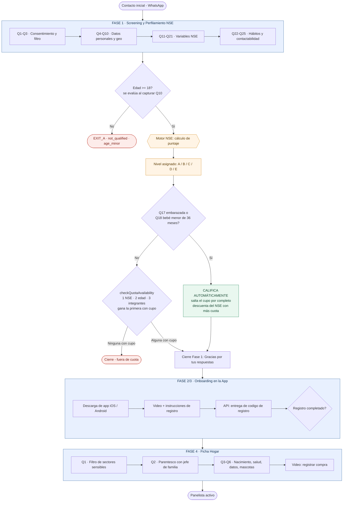
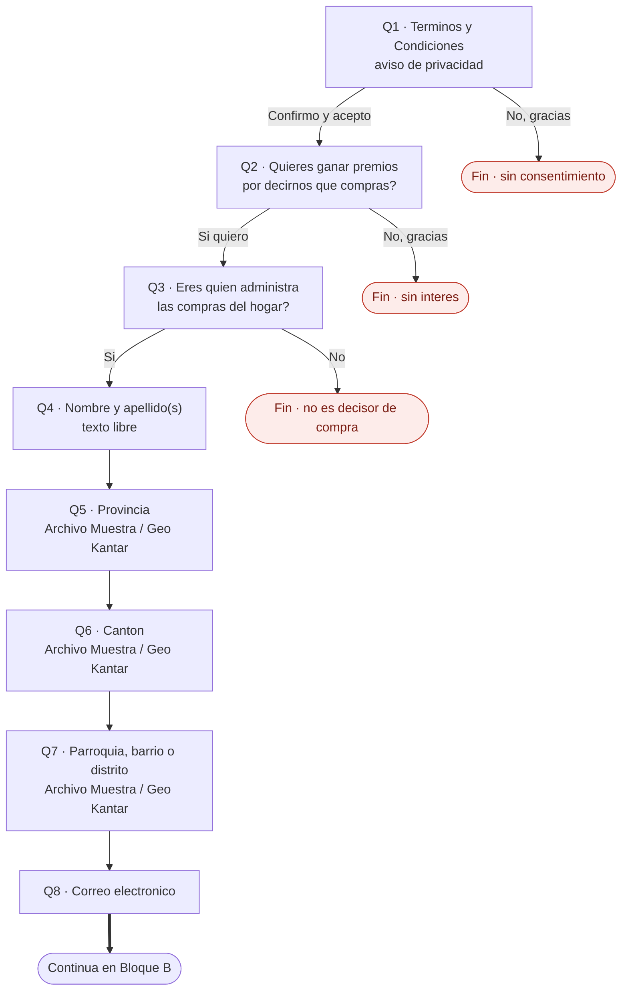
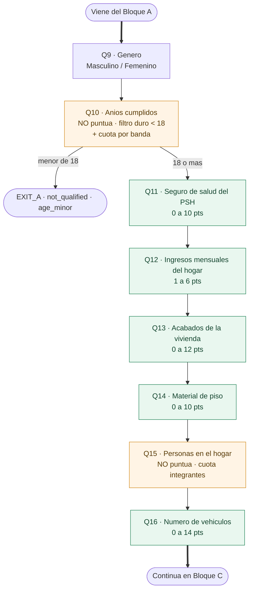
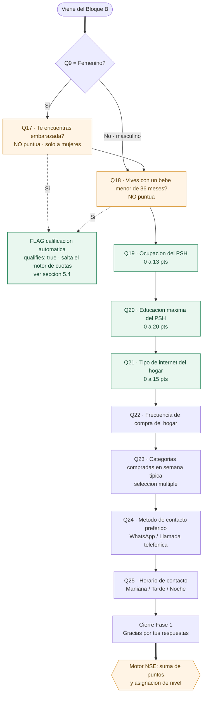
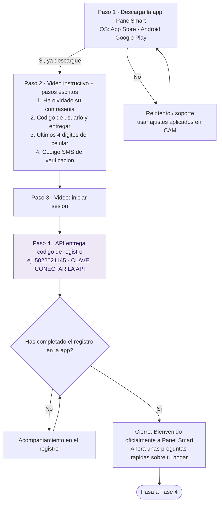
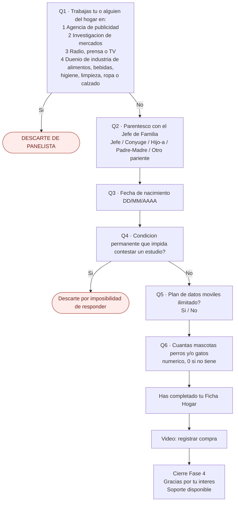
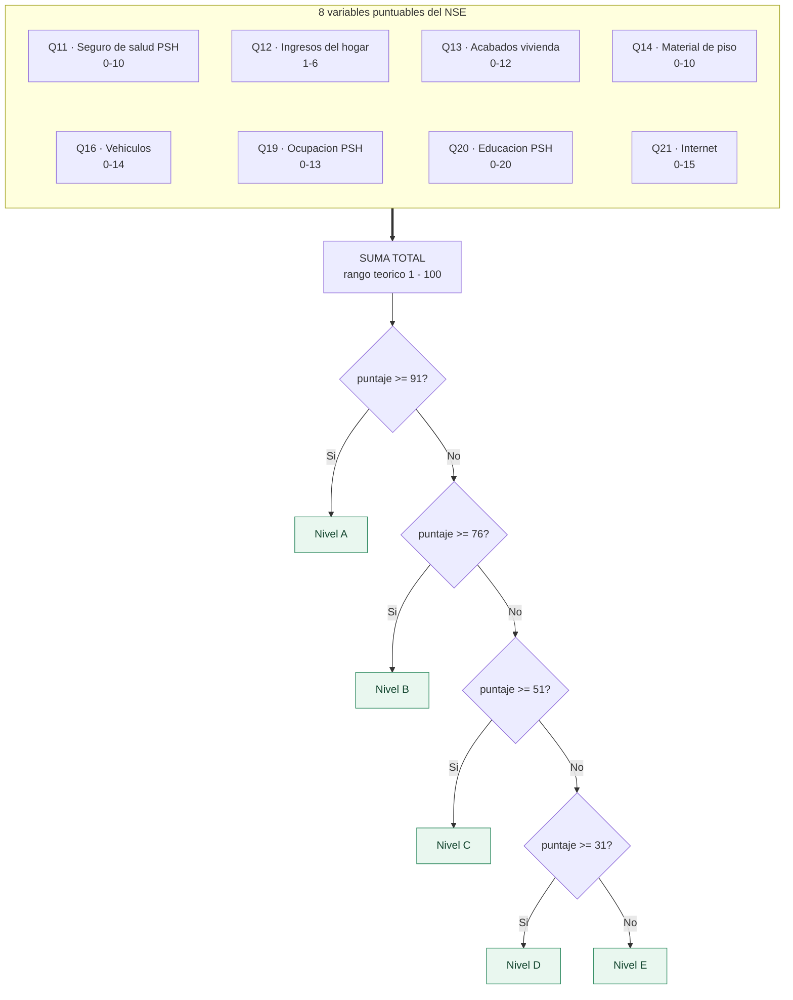
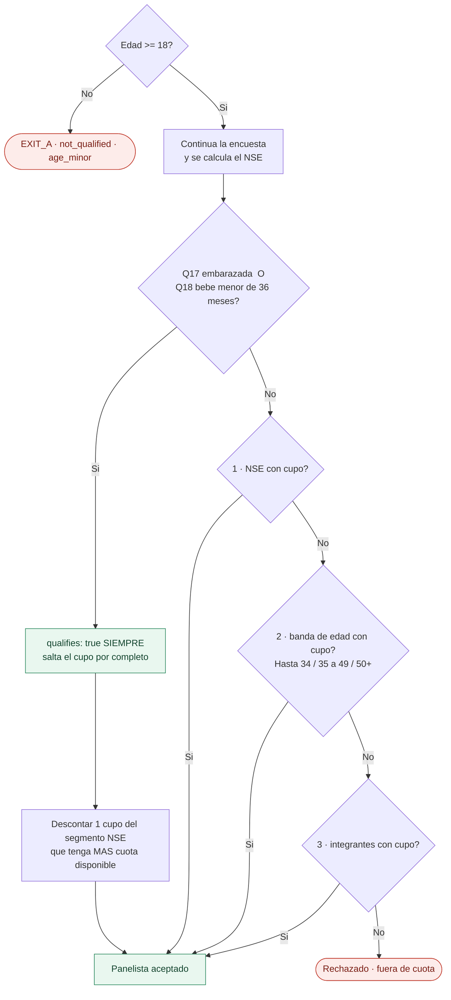

# Flujo de Reclutamiento — PanelSmart Ecuador (Kantar IA)

Documento generado a partir de `PreguntasyPuntaje_KantarIA_Ecuador.xlsx`
(hojas **Preguntas Ecuador** y **Puntaje NSE EC**).

---

## 1. Visión general del flujo



---

## 2. FASE 1 — Screening y perfilamiento (25 preguntas)

El flujo se presenta en tres bloques consecutivos.
🟩 verde = variable que puntúa en el NSE · 🟧 naranja = no puntúa, se usa como cuota o filtro · 🟥 rojo = salida del flujo.

### Bloque A — Consentimiento, filtro y datos de contacto (Q1–Q8)



### Bloque B — Perfil y variables NSE, primera parte (Q9–Q16)



### Bloque C — NSE segunda parte, hábitos y contactabilidad (Q17–Q25)



> **Nota:** las tres salidas por "No" (Q1 sin consentimiento, Q2 sin interés, Q3 no es quien
> administra las compras) **están confirmadas**: el flujo termina ahí y el contacto no continúa
> a las siguientes preguntas.

### Opciones de respuesta (Fase 1)

| # | Pregunta | Opciones | Rol |
|---|---|---|---|
| 1 | Términos y Condiciones | Confirmo y acepto / No, gracias | Consentimiento |
| 2 | ¿Quieres ganar premios? | Sí quiero / No, gracias | Interés |
| 3 | ¿Administras las compras del hogar? | Sí / No | Filtro de rol |
| 4 | Nombre y apellido(s) | Texto libre | Dato |
| 5 | Provincia | Archivo Muestra / Geo Kantar | Geo |
| 6 | Cantón | Archivo Muestra / Geo Kantar | Geo |
| 7 | Parroquia / barrio / distrito | Archivo Muestra / Geo Kantar | Geo |
| 8 | Correo electrónico | Texto libre | Dato |
| 9 | Género | Masculino / Femenino | Cuota |
| 10 | Años cumplidos | Numérico | **Filtro duro (<18 ⇒ EXIT_A) + cuota por banda** — no puntúa |
| 11 | Seguro de salud del PSH | Ninguno / IESS / Issfa / Isspol / Privada | **NSE** |
| 12 | Ingresos mensuales del hogar | <$400 / $401–700 / $701–1.000 / $1.001–2.000 / $2.001–3.000 / >$3.000 | **NSE** |
| 13 | Acabados de la vivienda | Tabla+Desechos / Tabla+Eternit / Cemento+Eternit / Cemento+Loza / Otro | **NSE** |
| 14 | Material de piso | Duela-Parquet / Cerámica / Ladrillo o cemento / Tierra o caña / Otros | **NSE** |
| 15 | Personas en el hogar | Numérico | **Dimensión de cuota `integrantes`** — no puntúa |
| 16 | ¿Cuántos vehículos dispone regularmente este hogar? | 0 / 1 / 2 / 3 / 4 o más | **NSE** |
| 17 | ¿Estás embarazada? | Sí / No | **Calificación automática** — solo se pregunta si Q9 = Femenino |
| 18 | ¿Vives con un bebé menor de 36 meses? | Sí / No | **Calificación automática** |
| 19 | Ocupación del PSH | 12 opciones | **NSE** |
| 20 | Educación máxima del PSH | 12 opciones | **NSE** |
| 21 | Tipo de internet | Sin internet / Datos móviles / Cable-ADSL / Fibra Óptica | **NSE** |
| 22 | Frecuencia de compra | Diario / 2-3 por semana / Semanal / Quincenal / Mensual | Perfil |
| 23 | Categorías compradas | Canasta básica, Lácteos, Bebidas, Snacks, Cuidado personal, Limpieza, Cuidado del bebé, Mascotas | Perfil (múltiple) |
| 24 | Método de contacto | WhatsApp / Llamada telefónica | Operativo |
| 25 | Horario de contacto | Mañana 9-12 / Tarde 13-17 / Noche 18-21 | Operativo |

---

## 3. FASE 2/3 — Onboarding en la app



**Puntos técnicos de esta fase**

- El código de registro se entrega vía **API** (`CLAVE CONECTAR LA API`) — es el único paso con integración externa del flujo.
- Los mensajes de cierre y los videos deben usar los **ajustes aplicados en CAM**.
- Esta fase **no aporta puntaje NSE**; es puramente de activación.

---

## 4. FASE 4 — Ficha Hogar



> **Numeración corregida:** el archivo original saltaba de la 2 a la 4 por un error de digitación;
> aquí las preguntas van **Q1 a Q6** consecutivas. Los dos descartes (Q1 por sector sensible y
> Q4 por condición permanente) **están confirmados**.

---

## 5. Motor de cálculo NSE



### 5.1 Tabla de puntos por respuesta

**Q11 — Seguro de salud del PSH** *(0–10)*

| Respuesta | Puntos |
|---|---|
| Ninguno | 0 |
| IESS | 2 |
| Issfa (militares) / Gobierno | 6 |
| Isspol (policías) | 6 |
| Privada | 10 |

**Q12 — Ingresos mensuales del hogar** *(1–6)*

| Respuesta | Puntos |
|---|---|
| Hasta $400 | 1 |
| $401 – $700 | 2 |
| $701 – $1.000 | 3 |
| $1.001 – $2.000 | 4 |
| $2.001 – $3.000 | 5 |
| Más de $3.000 | 6 |

**Q13 — Acabados de la vivienda (paredes y techo)** *(0–12)*

| Respuesta | Puntos |
|---|---|
| Tabla/madera + desechos o cartón | 0 |
| Tabla/madera + eternit o zinc | 3 |
| Cemento + eternit o zinc | 6 |
| Cemento/ladrillo + loza o teja | 9 |
| Otro | 12 |

**Q14 — Material de piso predominante** *(0–10)*

| Respuesta | Puntos |
|---|---|
| Duela, parquet, tablón o piso flotante | 10 |
| Cerámica, baldosa, vinil o marmetón | 7 |
| Ladrillo o cemento | 4 |
| Tierra / caña | 2 |
| Otros materiales | 0 |

**Q16 — ¿Cuántos vehículos dispone regularmente este hogar?** *(0–14)*

| Respuesta | Puntos |
|---|---|
| 0 | 0 |
| 1 | 6 |
| 2 | 9 |
| 3 | 12 |
| 4 o más | 14 |

**Q19 — Ocupación del jefe / ama de hogar (PSH)** *(0–13)*

| Respuesta | Puntos |
|---|---|
| Personal directivo de Administración Pública y empresas | 13 |
| Profesionales científicos e intelectuales | 12 |
| Técnicos y profesionales de nivel medio | 9 |
| Fuerzas Armadas | 8 |
| Empleados de oficina | 6 |
| Trabajadores de servicios y comerciantes | 4 |
| Operadores de instalaciones y máquinas | 4 |
| Trabajadores calificados agropecuarios y pesqueros | 3 |
| Oficiales, operarios y artesanos | 3 |
| Inactivos / Jubilado | 3 |
| Desocupados | 1 |
| Trabajadores no calificados | 0 |

**Q20 — Máximo nivel educativo del PSH** *(0–20)*

| Respuesta | Puntos |
|---|---|
| Ninguno / no alfabetizado | 0 |
| Alfabetizado pero no en escuela formal | 1 |
| Básica incompleta | 3 |
| Básica completa | 4 |
| Media incompleta | 5 |
| Media completa | 6 |
| Técnica incompleta | 8 |
| Técnica completa | 10 |
| Universidad incompleta | 12 |
| Universidad completa | 15 |
| Postgrado incompleto | 20 |
| Postgrado completo | 20 |

**Q21 — Tipo de internet del hogar** *(0–15)*

| Respuesta | Puntos |
|---|---|
| No tiene internet | 0 |
| Internet de celular (datos móviles) | 3 |
| Internet hogar contratado (cable/ADSL) | 8 |
| Internet hogar contratado (fibra óptica) | 15 |

### 5.2 Cortes de nivel socioeconómico

| Nivel | Puntaje |
|---|---|
| **A** | 91 y más |
| **B** | 76 – 90 |
| **C** | 51 – 75 |
| **D** | 31 – 50 |
| **E** | 0 – 30 |

> **Rango real: 1 a 100.** Como Q12 aporta mínimo 1 punto en cualquier respuesta, el total nunca
> puede ser 0 — el nivel E arranca de hecho en 1. El máximo teórico es 100
> (10 + 6 + 12 + 10 + 14 + 13 + 20 + 15).

**Esta es la escala oficial del proyecto.** La hoja trae además una tabla larga de lookup
(columna de 0 a 500) que devuelve solo tres etiquetas agrupadas — `D/E`, `C`, `AB` —; esa
agrupación **queda descartada** y no se usa ni para clasificar ni para cuotas.

### 5.3 Filtro de edad y motor de cuotas

La edad **no puntúa en el NSE**, pero interviene en el flujo en dos momentos completamente distintos.

**a) Como filtro duro de rechazo (piso de edad)** — `src/lib/conversation/age-eligibility.ts`

`MINIMUM_PANELIST_AGE = 18`. Si `edad < 18` el contacto sale con `not_qualified` / motivo
`age_minor` por la ruta **EXIT_A**. Se evalúa al capturar la edad (`phase-1.ts:484`) y otra vez
si el usuario la corrige después (`correction.ts:170`).

**b) Como una de tres dimensiones de cupo** — `src/lib/scoring/quota.ts`, al terminar la encuesta

`checkQuotaAvailability` evalúa **en orden fijo** y gana **la primera dimensión con cupo disponible**
(`progress.available > 0`):

| Orden | Dimensión | Bandas |
|---|---|---|
| 1 | **NSE** | segmento socioeconómico calculado |
| 2 | **Edad** | Hasta 34 · 35 a 49 · 50+ |
| 3 | **Integrantes** | tamaño del hogar (Q15) |



Consecuencia práctica del orden fijo: tener 40 años **solo clasifica** si (a) el NSE no matcheó
antes y (b) la banda *35 a 49* de su país/región todavía tiene cupo. Si esa banda está llena, la
edad no ayuda — se pasa a integrantes.

### 5.4 Excepción por embarazo o bebé menor de 36 meses

Es **la única regla que califica automáticamente** (`qualifies: true` siempre) y la única que
**salta el motor de cuotas por completo**. La edad **no** hace esto.

- Si **Q17 (embarazada) = Sí** o **Q18 (bebé menor de 36 meses) = Sí** → clasifica como panelista,
  sin pasar por `checkQuotaAvailability`.
- El cupo se **descuenta del segmento NSE que tenga más cuota disponible** — no del segmento NSE
  propio de la panelista. Así se protegen las celdas más escasas. **En caso de empate gana el
  segmento de mayor objetivo.**
- **No hay tope**: esta excepción no está limitada a un porcentaje máximo de la muestra.
- El nivel NSE **se sigue calculando igual**: Q17 y Q18 no suman puntos, solo levantan el flag.
- Si aplican Q17 y Q18 a la vez, sigue siendo **un solo cupo** descontado.

---

## 6. Pseudocódigo del cálculo

```ts
type RespuestasNSE = {
  seguroSalud: string;
  ingresos: string;
  acabados: string;
  piso: string;
  vehiculos: string;
  ocupacionPSH: string;
  educacionPSH: string;
  internet: string;
};

const PUNTOS = {
  seguroSalud:   { ninguno: 0, iess: 2, issfa: 6, isspol: 6, privada: 10 },
  ingresos:      { hasta400: 1, r401_700: 2, r701_1000: 3, r1001_2000: 4, r2001_3000: 5, mas3000: 6 },
  acabados:      { tablaDesechos: 0, tablaEternit: 3, cementoEternit: 6, cementoLoza: 9, otro: 12 },
  piso:          { duelaParquet: 10, ceramica: 7, ladrilloCemento: 4, tierraCania: 2, otros: 0 },
  vehiculos:     { '0': 0, '1': 6, '2': 9, '3': 12, '4omas': 14 },
  ocupacionPSH:  { directivo: 13, cientifico: 12, tecnicoMedio: 9, ffaa: 8, oficina: 6,
                   serviciosComercio: 4, operadorMaquinaria: 4, agropecuario: 3,
                   artesano: 3, inactivoJubilado: 3, desocupado: 1, noCalificado: 0 },
  educacionPSH:  { ninguno: 0, alfabNoFormal: 1, basicaInc: 3, basicaComp: 4, mediaInc: 5,
                   mediaComp: 6, tecnicaInc: 8, tecnicaComp: 10, univInc: 12, univComp: 15,
                   postgradoInc: 20, postgradoComp: 20 },
  internet:      { sinInternet: 0, datosMoviles: 3, cableAdsl: 8, fibra: 15 },
} as const;

function calcularPuntaje(r: RespuestasNSE): number {
  return (Object.keys(PUNTOS) as (keyof typeof PUNTOS)[])
    .reduce((total, k) => total + (PUNTOS[k] as Record<string, number>)[r[k]], 0);
}

function nivelNSE(puntaje: number): 'A' | 'B' | 'C' | 'D' | 'E' {
  if (puntaje >= 91) return 'A';
  if (puntaje >= 76) return 'B';
  if (puntaje >= 51) return 'C';
  if (puntaje >= 31) return 'D';
  return 'E';
}
```

### Filtro de edad, excepción automática y motor de cuotas

```ts
const MINIMUM_PANELIST_AGE = 18;

type Nivel = 'A' | 'B' | 'C' | 'D' | 'E';
type BandaEdad = 'Hasta 34' | '35 a 49' | '50+';
type Dimension = 'nse' | 'edad' | 'integrantes';

type Cupo = { clave: string; objetivo: number; usados: number };
const disponible = (c: Cupo) => c.objetivo - c.usados;

type Cuotas = {
  nse: Record<Nivel, Cupo>;
  edad: Record<BandaEdad, Cupo>;
  integrantes: Record<string, Cupo>;
};

// 1) Filtro duro — se evalúa al capturar la edad y en cada corrección posterior
function esElegiblePorEdad(edad: number): boolean {
  return edad >= MINIMUM_PANELIST_AGE; // < 18  =>  not_qualified / 'age_minor'  (EXIT_A)
}

function bandaEdad(edad: number): BandaEdad {
  if (edad <= 34) return 'Hasta 34';
  if (edad <= 49) return '35 a 49';
  return '50+';
}

type Resultado =
  | { qualifies: true; via: 'excepcion_automatica' | Dimension; cupoDebitado: string }
  | { qualifies: false; motivo: 'age_minor' | 'fuera_de_cuota' };

function checkQuotaAvailability(
  perfil: { edad: number; nivel: Nivel; integrantes: number },
  flags: { embarazada: boolean; bebeMenor36Meses: boolean },
  cuotas: Cuotas,
): Resultado {
  if (!esElegiblePorEdad(perfil.edad)) {
    return { qualifies: false, motivo: 'age_minor' };
  }

  // 2) Excepción: única regla que califica siempre y salta el motor de cuotas.
  //    El cupo se debita del segmento NSE con MÁS cuota disponible, no del propio.
  if (flags.embarazada || flags.bebeMenor36Meses) {
    const destino = Object.values(cuotas.nse)
      .sort((a, b) => disponible(b) - disponible(a) || b.objetivo - a.objetivo)[0];
    destino.usados += 1;
    return { qualifies: true, via: 'excepcion_automatica', cupoDebitado: destino.clave };
  }

  // 3) Tres dimensiones en ORDEN FIJO: gana la primera con cupo disponible.
  const candidatos: [Dimension, Cupo][] = [
    ['nse', cuotas.nse[perfil.nivel]],
    ['edad', cuotas.edad[bandaEdad(perfil.edad)]],
    ['integrantes', cuotas.integrantes[String(perfil.integrantes)]],
  ];

  for (const [via, cupo] of candidatos) {
    if (cupo && disponible(cupo) > 0) {
      cupo.usados += 1;
      return { qualifies: true, via, cupoDebitado: cupo.clave };
    }
  }

  return { qualifies: false, motivo: 'fuera_de_cuota' };
}
```

---

## 7. Observaciones y puntos a validar

### 7.1 Puntos abiertos (matriz de puntaje)

1. **Q13 — "Otro" = 12 puntos** es el valor más alto de la variable, por encima de "cemento + loza/teja" (9). Si "Otro" es un cajón de sastre, un encuestado puede subir de nivel eligiéndolo. Vale la pena confirmarlo con Kantar.
2. **Q20 — postgrado incompleto y completo empatan en 20 puntos**; puede ser intencional o un error de la matriz.

### 7.2 Reglas ya confirmadas

- **Rango real del puntaje: 1 a 100.** Q12 (ingresos) aporta como mínimo **1 punto** en cualquier respuesta, así que el total **nunca puede ser 0**; el máximo es 100 (10+6+12+10+14+13+20+15). El nivel E está definido como 0–30, pero en la práctica arranca en 1.
- **Clasificación NSE — escala oficial**: se usa la **tabla chica de 5 niveles** (A 91+, B 76–90, C 51–75, D 31–50, E 0–30). La tabla larga de lookup, que agrupa en `AB` / `C` / `D/E`, **no se usa**.
- **Fase 4 — numeración corregida**: el salto de Q2 a Q4 en el archivo era un error de digitación; las preguntas quedan como **Q1 a Q6** consecutivas.
- **Q16 — texto unificado**: la pregunta que ve el panelista es **"¿Cuántos vehículos dispone regularmente este hogar?"**. Se descarta la aclaración *"de uso personal, excepto de uso para taxi o trabajo"* que traía la hoja de puntaje.
- **Orden fijo de las tres dimensiones**: NSE → edad → integrantes, siempre en ese orden y sin prioridades variables según el momento del campo. Gana la primera dimensión con cupo disponible.
- **Q15 (personas en el hogar)** no entra al puntaje NSE pese a la nota *"SÍ INFLUYE EN EL CÁLCULO"* de la hoja: es la **tercera dimensión de cuota** (`integrantes`), no un sumando.
- **Q10 (edad)** tampoco puntúa: es **filtro duro** (`< 18` ⇒ `age_minor`, EXIT_A) y **segunda dimensión de cuota** por bandas.
- **Q17 (embarazo)** solo aplica a mujeres: el bot no debe preguntarla cuando **Q9 = Masculino**; en ese caso se registra como "No aplica" para no ensuciar la cuota.
- **Q17 / Q18** son la **única** vía de calificación automática (`qualifies: true` siempre); la edad no lo es.
- **Sin tope**: la calificación automática por embarazo o bebé menor de 36 meses **no tiene límite** de porcentaje sobre la muestra.
- **"El NSE que tenga más cuota"** = el segmento con **mayor disponibilidad restante** (`objetivo − usados`), no el de mayor objetivo absoluto ni el de mayor porcentaje libre.
- **Desempate**: si dos segmentos NSE quedan con la misma disponibilidad, gana **el de mayor objetivo**.
- **Las salidas de Fase 1** (Q1, Q2, Q3) y los **descartes de Fase 4** (Q1 y Q4) están confirmados.
