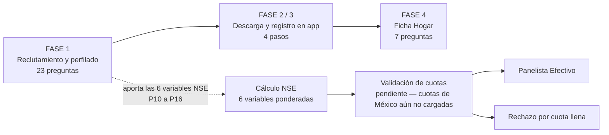
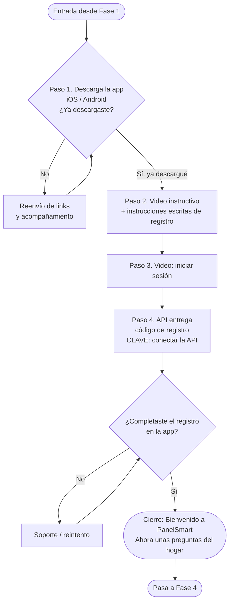
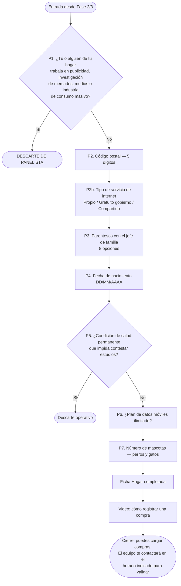
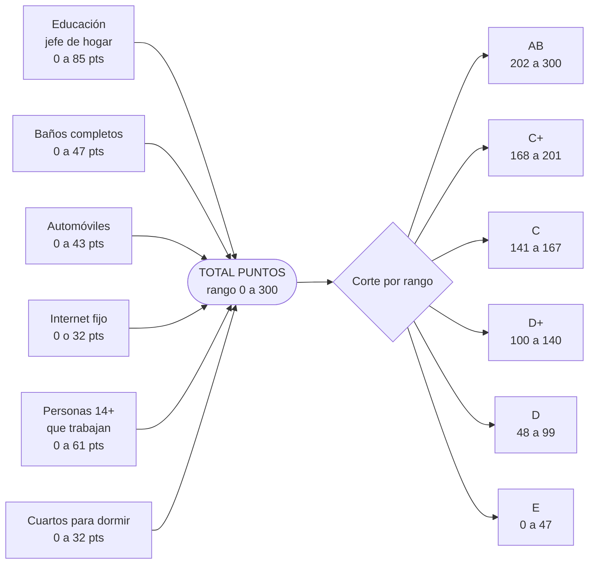

# Flujo de Preguntas PanelSmart — Fases y Calificación NSE

**Fuentes:**
- `Muestra Regiones NSE Preguntas Mexico.xlsx` → hojas `Preguntas México`, `Puntaje`, `Tabla NSE`, `Marco Muestral`

> Este documento cubre **solo México**. La sección de cuotas (Región × NSE / Integrantes / Edad) que aparecía aquí antes venía de `CUOTAS KANTAR IA EC - 10 de Sept 2026.xlsx` — un archivo de **Ecuador** archivado por error en `docs/mexico/`. Se removió porque no aplica a este país; las cuotas reales de México deben cargarse desde el marco muestral mexicano (hoja `Marco Muestral` del archivo de arriba) cuando esté disponible.

---

## 1. Visión general del flujo

---

## 2. FASE 1 — Reclutamiento y perfilado

```mermaid
flowchart TD
    START(["Contacto inicial"]) --> P1{"P1. ¿Te gustaría inscribirte<br/>en PanelSmart y ganar premios?"}
    P1 -- "No" --> OUT1(["Fin — no interesado"])
    P1 -- "Inscribirme" --> P2{"P2. ¿Aceptas Términos<br/>y Condiciones?"}

    P2 -- "No, gracias" --> OUT2(["Fin — sin consentimiento"])
    P2 -- "Confirmo y acepto" --> P3{"P3. ¿Eres quien administra<br/>las compras del hogar?"}

    P3 -- "No" --> OUT3(["Descarte — no es ama/o de casa"])
    P3 -- "Sí" --> P4["P4. Nombre y apellido"]

    P4 --> P5["P5. Estado<br/>valida contra Marco Muestral / Geo Kantar"]
    P5 --> P6["P6. Municipio<br/>valida contra Marco Muestral / Geo Kantar"]
    P6 --> P7["P7. Correo electrónico"]
    P7 --> P8["P8. Género: Hombre / Mujer"]
    P8 --> P9["P9. Edad cumplida<br/>CUOTA extra — no puntúa NSE"]

    P9 --> BLOQ["BLOQUE NSE — P10 a P16"]

    BLOQ --> P10["P10. Educación del jefe/a de hogar<br/>PUNTÚA"]
    P10 --> P11["P11. Baños completos<br/>PUNTÚA"]
    P11 --> P12["P12. Automóviles<br/>PUNTÚA"]
    P12 --> P13["P13. Internet fijo en el hogar<br/>PUNTÚA"]
    P13 --> P14["P14. Personas en el hogar<br/>CUOTA — sí influye en el cálculo"]
    P14 --> P15["P15. Personas 14+ que trabajaron<br/>último mes — PUNTÚA"]
    P15 --> P16["P16. Cuartos para dormir<br/>PUNTÚA"]

    P16 --> P17["P17. ¿Embarazada?<br/>CUOTA extra — no puntúa"]
    P17 --> P18["P18. ¿Bebé menor de 3 años?<br/>CUOTA extra — no puntúa"]
    P18 --> P19["P19. Frecuencia de compra<br/>Diario / 2-3 sem / Semanal / Quincenal / Mensual"]
    P19 --> P20["P20. Categorías que compra<br/>multi-respuesta, 8 opciones"]
    P20 --> P21["P21. Contacto preferido<br/>WhatsApp / Llamada"]
    P21 --> P22["P22. Horario de contacto<br/>Mañana / Tarde / Noche"]
    P22 --> P23{"P23. ¿Completaste el registro<br/>en la app PanelSmart?"}

    P23 -- "Sí, ya descargué" --> C1(["Cierre Fase 1<br/>Gracias por tus respuestas"])
    P23 -- "No" --> C1
    C1 --> F2(["Pasa a Fase 2/3"])
```

### Preguntas de Fase 1

| # | Pregunta | Respuestas | Rol |
|---|---|---|---|
| 1 | ¿Te gustaría inscribirte en PanelSmart? | Inscribirme / No | Filtro |
| 2 | ¿Aceptas Términos y Condiciones? | Confirmo y acepto / No, gracias | Filtro legal |
| 3 | ¿Eres quien administra las compras del hogar? | Sí / No | **Filtro duro** |
| 4 | Nombre y apellido | Abierta | Identificación |
| 5 | Estado | Archivo Muestra / Geo Kantar | Cuota región |
| 6 | Municipio | Archivo Muestra / Geo Kantar | Cuota región |
| 7 | Correo electrónico | Abierta | Identificación |
| 8 | Género | Hombre / Mujer | Perfil |
| 9 | Edad cumplida | Abierta | **Cuota, no puntúa** |
| 10 | Educación del jefe/a de hogar | 10 opciones | **NSE** |
| 11 | Baños completos | 0 / 1 / 2 o más | **NSE** |
| 12 | Automóviles | 0 / 1 / 2 o más | **NSE** |
| 13 | Internet en el hogar | No tiene / Sí tiene | **NSE** |
| 14 | Personas en el hogar | Abierta | **Cuota — sí influye** |
| 15 | Personas 14+ que trabajaron | 0 / 1 / 2 / 3 / 4 o más | **NSE** |
| 16 | Cuartos para dormir | 0 / 1 / 2 / 3 / 4 o más | **NSE** |
| 17 | ¿Embarazada? | Sí / No | Cuota, no puntúa |
| 18 | ¿Bebé menor de 3 años? | Sí / No | Cuota, no puntúa |
| 19 | Frecuencia de compra | Diario / 2-3 sem / Semanal / Quincenal / Mensual | Perfil |
| 20 | Categorías que compra | 8 opciones, multi-respuesta | Perfil |
| 21 | Método de contacto preferido | WhatsApp / Llamada | Operativo |
| 22 | Horario de contacto | Mañana 9-12 / Tarde 13-17 / Noche 18-21 | Operativo |
| 23 | ¿Completaste registro en la app? | Sí / No | Control |

---

## 3. FASE 2 / 3 — Descarga y registro en la app

**Pasos clave del registro descritos en el documento:**

1. Abrir la app e ingresar a «¿Ha olvidado su contraseña?»
2. Escribir el código de usuario y pulsar «entregar»
3. Escribir los últimos 4 dígitos del celular registrado
4. Ingresar el código recibido por SMS para terminar la verificación

> ⚠️ **Punto de integración:** el código de registro (ej. `5022021145`) lo entrega la API. Es la dependencia técnica del flujo.

---

## 4. FASE 4 — Ficha Hogar

**Opciones de parentesco (P3):** Jefe de Familia · Cónyuge · Hijo(a)/Hijastro(a) · Padre/Madre/Suegro · Agregado · Inquilino · Empleada doméstica · Pariente de empleada doméstica

---

## 5. Calificación NSE — Tabla de puntos

El NSE se calcula con **6 variables** de la Fase 1. La suma de los 6 puntajes determina el nivel.

### 5.1 Educación del jefe o jefa de hogar

| Respuesta | Puntos |
|---|---|
| Sin instrucción escolar | 0 |
| Alfabetizado pero no en escuela formal | 0 |
| Primaria incompleta | 6 |
| Primaria completa | 11 |
| Secundaria incompleta | 12 |
| Secundaria completa | 18 |
| Prepa / Bachillerato / Carrera incompleta | 23 |
| Prepa / Bachillerato / Carrera completa | 27 |
| Licenciatura incompleta | 36 |
| Licenciatura completa | 59 |
| Posgrado incompleto | 85 |
| Posgrado completo / Diplomado / Maestría / Doctorado | 85 |

### 5.2 Baños completos con regadera y W.C.

| Respuesta | Puntos |
|---|---|
| 0 | 0 |
| 1 | 24 |
| 2 o más | 47 |

### 5.3 Automóviles o camionetas en el hogar

| Respuesta | Puntos |
|---|---|
| 0 | 0 |
| 1 | 22 |
| 2 o más | 43 |

### 5.4 Internet fijo en el hogar

| Respuesta | Puntos |
|---|---|
| No tiene | 0 |
| Sí tiene | 32 |

### 5.5 Personas de 14+ que trabajaron el último mes

| Respuesta | Puntos |
|---|---|
| 0 | 0 |
| 1 | 15 |
| 2 | 31 |
| 3 | 46 |
| 4 o más | 61 |

### 5.6 Cuartos usados para dormir

| Respuesta | Puntos |
|---|---|
| 0 | 0 |
| 1 | 8 |
| 2 | 16 |
| 3 | 24 |
| 4 o más | 32 |

### 5.7 Tabla de corte Puntos → Nivel

| Puntos | NSE |
|---|---|
| 202 – 300 | **AB** |
| 168 – 201 | **C+** |
| 141 – 167 | **C** |
| 100 – 140 | **D+** |
| 48 – 99 | **D** |
| 0 – 47 | **E** |

> **Nota:** la hoja `Puntaje` trae dos versiones del corte. La tabla detallada punto por punto (columnas N–O) separa **D (48–99)** de **E (0–47)**; la tabla resumen (columnas Q–R) las agrupa como **D/E (6–99)**. Para el reporte a Kantar, el agrupamiento usado en las cuotas es **AB / C / DE**.

### 5.8 Ejemplo de cálculo (hoja `Tabla NSE`)

| Variable | Respuesta | Puntos |
|---|---|---|
| Educación jefe de hogar | Primaria completa | 11 |
| Baños | 1 | 24 |
| Automóviles | 0 | 0 |
| Internet | No tiene | 0 |
| Personas que trabajan | 3 | 46 |
| Cuartos para dormir | 3 | 24 |
| **Total** | | **105** |
| **NSE resultante** | | **D+** |
| **Estatus final** | | Efectiva |

---

## 6. Cuotas México — pendiente

Una vez calculado el NSE, el panelista debe validarse contra cuotas cruzadas por región (Región × NSE, y posiblemente Integrantes/Edad, como en el resto de países del flujo). **Esta sección se removió** porque la que existía aquí antes eran las cuotas de Ecuador (`CUOTAS KANTAR IA EC - 10 de Sept 2026.xlsx`, archivo mal ubicado en `docs/mexico/`), no aplicables a este país.

Para completar esta sección se necesita el marco muestral/cuotas real de México (hoja `Marco Muestral` de `Muestra Regiones NSE Preguntas Mexico.xlsx`, o el archivo de cuotas equivalente al de Ecuador pero para México). Mientras tanto, `quota_targets` en la base de datos no tiene filas para `country = 'México'`, por lo que ningún lead mexicano puede calificar como "Efectiva" por cuota hasta que se carguen (vía `npm run db:seed:mexico-quota-example` como referencia, o el importador de Excel en `src/lib/quotas/excel-import.ts`).

---

## 7. Observaciones para la implementación

1. **Desalineación de catálogos en educación.** La pregunta P10 de `Preguntas México` ofrece 10 opciones; la tabla de puntaje tiene 12 (incluye "Alfabetizado pero no en escuela formal", y separa "Posgrado incompleto" de "Posgrado completo"). Hay que mapear explícitamente:
   - "Carrera Incompleta" → *Prepa/Bachillerato/Carrera incompleta* = 23
   - "Carrera Completa" → *Prepa/Bachillerato/Carrera completa* = 27
   - "Posgrado" → 85 (ambas variantes valen igual, no genera ambigüedad de puntaje)

2. **Preguntas de cuota vs. preguntas de puntaje.** Solo 6 preguntas alimentan el NSE. Edad (P9), embarazo (P17) y bebé menor de 3 años (P18) son cuotas que **no** suman puntos. Integrantes del hogar (P14) está marcada como *"SÍ INFLUYE EN EL CÁLCULO"* pero no aparece en la tabla de puntos — sirve como cuota cruzada (sección 6.2), no como sumando.

3. **Dos filtros duros** cortan el flujo: P3 de Fase 1 (no administra las compras) y P1 de Fase 4 (trabaja en sectores sensibles). Un tercero, más suave, es la condición de salud permanente en Fase 4. La pregunta de sectores sensibles (P1 de Fase 4) se pregunta **una sola vez**, en Ficha Hogar — antes se repetía también al inicio de Fase 1 por un bug en el código, ya corregido.

4. **Dependencia de API** en Fase 2/3: el código de registro se entrega desde el backend. Sin ese paso el flujo se bloquea.

5. **Cuotas pendientes.** Ver sección 6 — México aún no tiene cuotas cargadas en `quota_targets`; se necesita el marco muestral/cuotas real del país antes de que la validación de cuota pueda calificar leads como "Efectiva".
